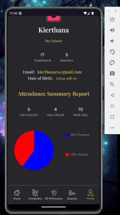
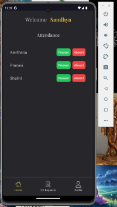
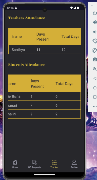
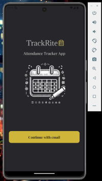

# TrackRite

TrackRite is a comprehensive attendance management system designed specifically for college environments. It streamlines the process of attendance tracking, request management, and communication between students, teachers, and HODs.

## Features

### Students

- **View OD and Outpass Requests:** Track the status of your On-Duty (OD) and Outpass requests.
- **Raise a Complaint:** Submit complaints for review by the administration.
- **Request for OD:** Submit OD requests for approval by your teacher and HOD.
- **Request for Outpass:** Submit outpass requests for approval.
- **View Profile:** Access your profile details along with a pie chart displaying your attendance statistics (present and absent percentage).


 
 
 
 
 
 


### Teachers

- **Take Students Attendance:** Mark and manage the attendance of students in your classes.
- **Approve OD and Outpass Requests:** Review and approve OD and outpass requests submitted by students.
- **View Details:** Access your profile details along with a pie chart showing the attendance statistics (present percentage) of students.





### HOD (Head of Department)

- **Take Teachers Attendance:** Mark and manage the attendance of teachers in your department.
- **Approve OD and Outpass Requests:** Review and approve OD and outpass requests that have been pre-approved by the respective teachers.
- **View All Details:** Access comprehensive details of students' and teachers' attendance, including individual attendance records.
- **View Profile:** Access your profile details and review complaints raised by students.




### Authentication

- **Sign-In Page:** 
  - Users can sign in using their email and password.
  - Upon successful sign-in, users are redirected to their respective dashboards (student, teacher, or HOD) based on their role.
 


  
  

## Installation

1. **Clone the repository:**
   ```sh
   git clone https://github.com/KierthanaRS/TrackRite.git
   ```
2. **Navigate to the project directory:**
   ```sh
   cd trackrite
   ```
3. **Install dependencies:**
   ```sh
   npm install
   ```
4. **Start the development server:**
   ```sh
   npm start
   ```

## Contributing

We welcome contributions to improve TrackRite. To contribute, please follow these steps:

1. Fork the repository.
2. Create a new branch (`git checkout -b feature/your-feature-name`).
3. Make your changes.
4. Commit your changes (`git commit -m 'Add some feature'`).
5. Push to the branch (`git push origin feature/your-feature-name`).
6. Open a pull request.

## Starting With EXPO

Welcome to the Expo app 👋

This is an [Expo](https://expo.dev) project created with [`create-expo-app`](https://www.npmjs.com/package/create-expo-app).

### Get started

1. **Install dependencies:**
   ```bash
   npm install
   ```
2. **Start the app:**
   ```bash
   npx expo start
   ```
   In the output, you'll find options to open the app in a:
   - [Development build](https://docs.expo.dev/develop/development-builds/introduction/)
   - [Android emulator](https://docs.expo.dev/workflow/android-studio-emulator/)
   - [iOS simulator](https://docs.expo.dev/workflow/ios-simulator/)
   - [Expo Go](https://expo.dev/go), a limited sandbox for trying out app development with Expo

You can start developing by editing the files inside the **app** directory. This project uses [file-based routing](https://docs.expo.dev/router/introduction/).

### Get a fresh project

When you're ready, run:
```bash
npm run reset-project
```
This command will move the starter code to the **app-example** directory and create a blank **app** directory where you can start developing.

### Learn more

To learn more about developing your project with Expo, look at the following resources:
- [Expo documentation](https://docs.expo.dev/): Learn fundamentals, or go into advanced topics with our [guides](https://docs.expo.dev/guides).
- [Learn Expo tutorial](https://docs.expo.dev/tutorial/introduction/): Follow a step-by-step tutorial where you'll create a project that runs on Android, iOS, and the web.

### Join the community

Join our community of developers creating universal apps.
- [Expo on GitHub](https://github.com/expo/expo): View our open source platform and contribute.
- [Discord community](https://chat.expo.dev): Chat with Expo users and ask questions.

